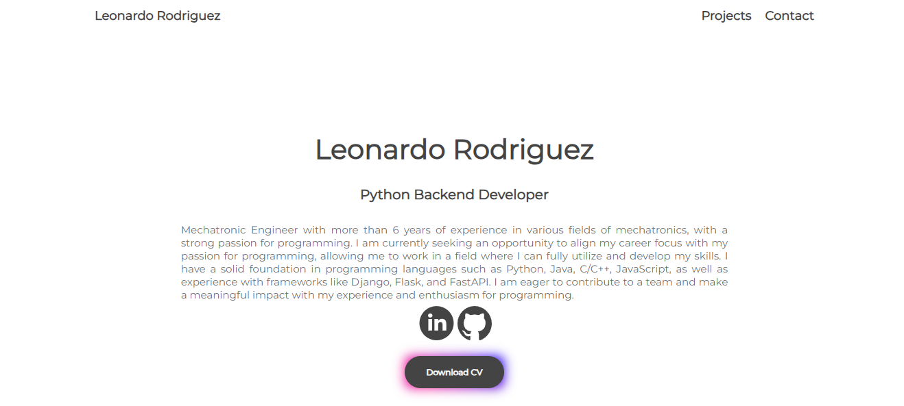

# Portfolio

This is a portfolio website created with Django, HTML and CSS.

## Features

The website has the following features:

Home page: Includes information about the author and a list of projects.
About page: Includes a brief summary of the author's background and skills.
Projects page: Includes a list of the author's projects with descriptions, links, and images.
Contact page: Includes a form that visitors can use to contact the author.
Getting Started

### To run this website locally, follow these steps:

> Clone this repository.

> Install the required packages listed in the requirements.txt file.
> Run python manage.py migrate to apply the database migrations.
> Create a superuser with python manage.py createsuperuser.
> Run python manage.py runserver to start the development server.
> Visit http://localhost:8000 in your web browser to view the website.
### Deployment
> To deploy this website to a production server, you can use a service like Heroku or PythonAnywhere. Before deploying, make sure to set the SECRET_KEY and DEBUG environment variables as appropriate for your deployment environment.